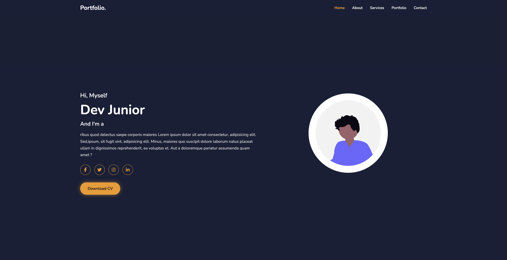
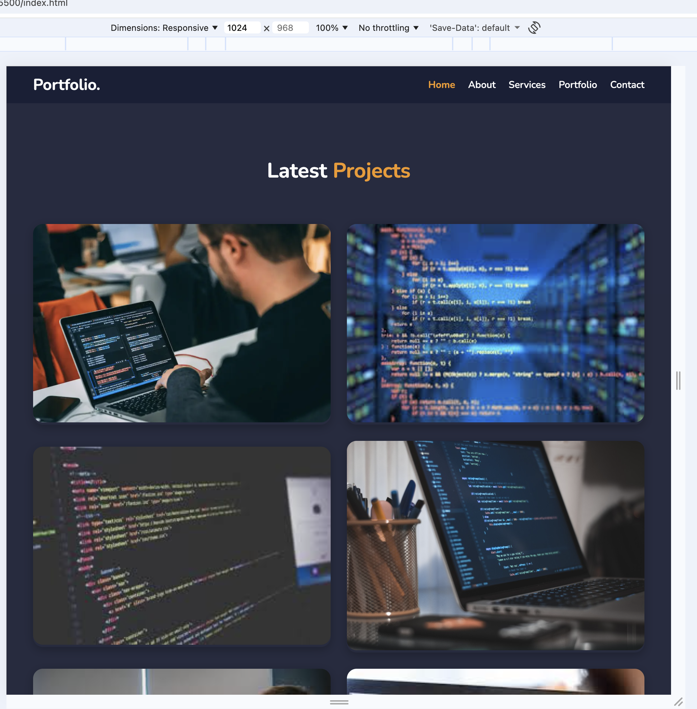
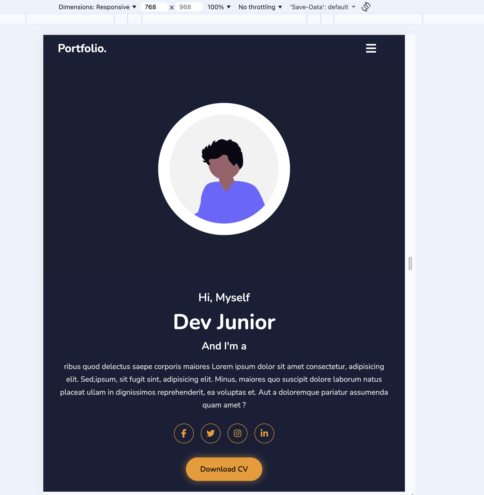

# Portfolio Personnel – HTML & CSS

## Description
Ce projet est un **site web de portfolio personnel responsive**, développé uniquement en **HTML** et **CSS**.  
Il présente le profil d’un développeur à travers une **page unique (One Page)** comportant plusieurs sections :

- **Home (Accueil)** : Présentation et réseaux sociaux  
- **About (À propos)** : Informations sur le parcours  
- **Services** : Domaines d’expertise  
- **Latest Projects** : Galerie de réalisations avec effets au survol  
- **Contact Me** : Formulaire de contact et carte Google Maps intégrée  
- **Footer** : Mentions légales et bouton de retour en haut  

---

## Objectifs
- Maîtriser la structuration sémantique en **HTML5**  
- Utiliser **Flexbox** et **CSS Grid** pour la mise en page  
- Créer un design **responsive** 
- Respecter un **thème sombre moderne** avec des animations fluides  

---

##  Technologies utilisées
- **HTML5**  
- **CSS3**  
- **Font Awesome** *(icônes)*  
- **Google Fonts** *(Nunito)*  

---

## Mise en page
- **Navbar** fixe en haut de page  
- **Sections** en pleine hauteur (`min-height: 100vh`)  
- **Flexbox** → pour les sections *Home* et *About*  
- **Grid** → pour *Services* et *Portfolio*  
- **Formulaire Contact** : disposition en deux colonnes (carte + formulaire)  

---

## Fonctionnalités
- **Navbar fixe** avec effet de couleur au clic  
- **Boutons animés** (ombre et survol)  
- **Image de profil animée** (mouvement vertical fluide)  
- **Effet de superposition** au survol des projets  
- **Formulaire de contact centré** et totalement responsive  
- **Bouton de retour en haut de page**  

---

## Structure du projet

---

## Auteur
Projet réalisé par **[ALHER MATOU Abdallah]**    

---

## Lien 

- Repo Github : 
- Page : 

